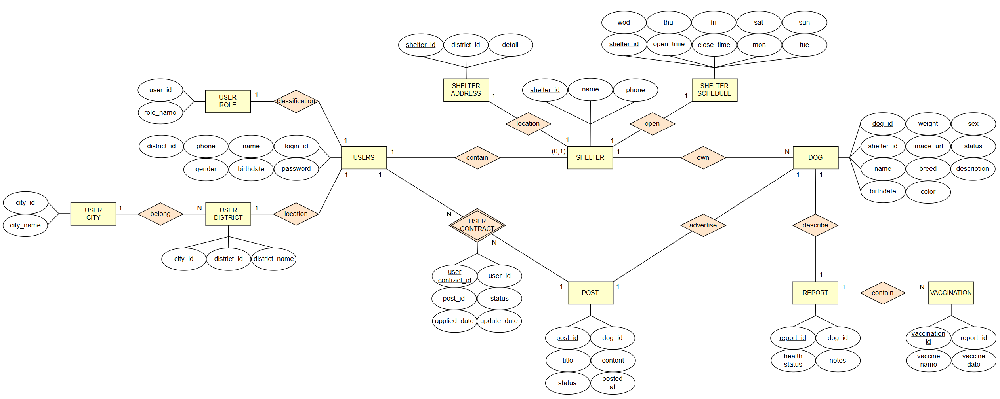

# Dogs Matching Platform

> 2025년 홍익대학교 소프트웨어융합학과 데이터베이스 팀 프로젝트
>
> PHP와 Oracle을 기반으로 유기견 입양 매칭 웹 서비스 플랫폼 개발

## 1. Team Member

- [C093299 홍민기](https://github.com/mingimouse) [조장]
- [C089059 정도영](https://github.com/JDoYoung)
- [C289003 김건우](https://github.com/Geon-NI)

## 2. Overview


**Topic**: 유기견 보호소와 입양 희망자를 연결하는 **유기견 매칭 플랫폼**

- `일반 사용자`는 다양한 조건으로 유기견을 조회하고 입양 신청을 할 수 있다.
- `보호소 사용자`는 유기견 입양 공고를 등록, 수정, 심사, 삭제를 할 수 있다.

## 3. Database Design

### 3.1. 개념적 설계


### 3.2. 논리적 설계



### 3.3. 물리적 설계


## 4. Git Convention

### 4.1. Branch Strategy

```bash
main	# 배포용 (최종 버전)
develop	# 개발 통합용 브랜치
feature	# 추가 기능 개발 브랜치
```

### 4.2. Commit Message Convention

```bash
# commit message 규칙
<type>(<scope>): <subject>

# commit type
feat		# 새로운 기능 추가
fix 		# 버그, 오류 수정
docs		# 문서 수정 (README, 주석)
style		# 코드 포맷, 세미콜론 등 스타일 수정 (로직X)
refactor	# 코드 리팩토링
chore		# 빌드/환경설정/연결 등 기타 작업
merge		# 브랜치 병합

# subject는 명령문 형태로 작성 (추가, 수정, 삭제, 변경)
# 마침표는 사용하지 않음
```

```bash
# 예시
feat(dog): 강아지 상태 컬럼 추가
docs(README): 개발 환경 설명 수정
```

### 4.3. PR Convention

```bash
# PR 제목 규칙
[type] 설명
```

```bash
# 예시
[feat] 사용자 로그인 기능 추가
[fix] shelter 테이블 is_active 필드 수정
```

### 4.4. Naming Convention

| 구분          | 규칙                | 예시                |
| ------------- | ------------------- | ------------------- |
| PHP           | 소문자 + 언더스코어 | `user_register.php` |
| HTML, CSS, JS | 소문자 + 하이픈     | `main-style.css`    |
